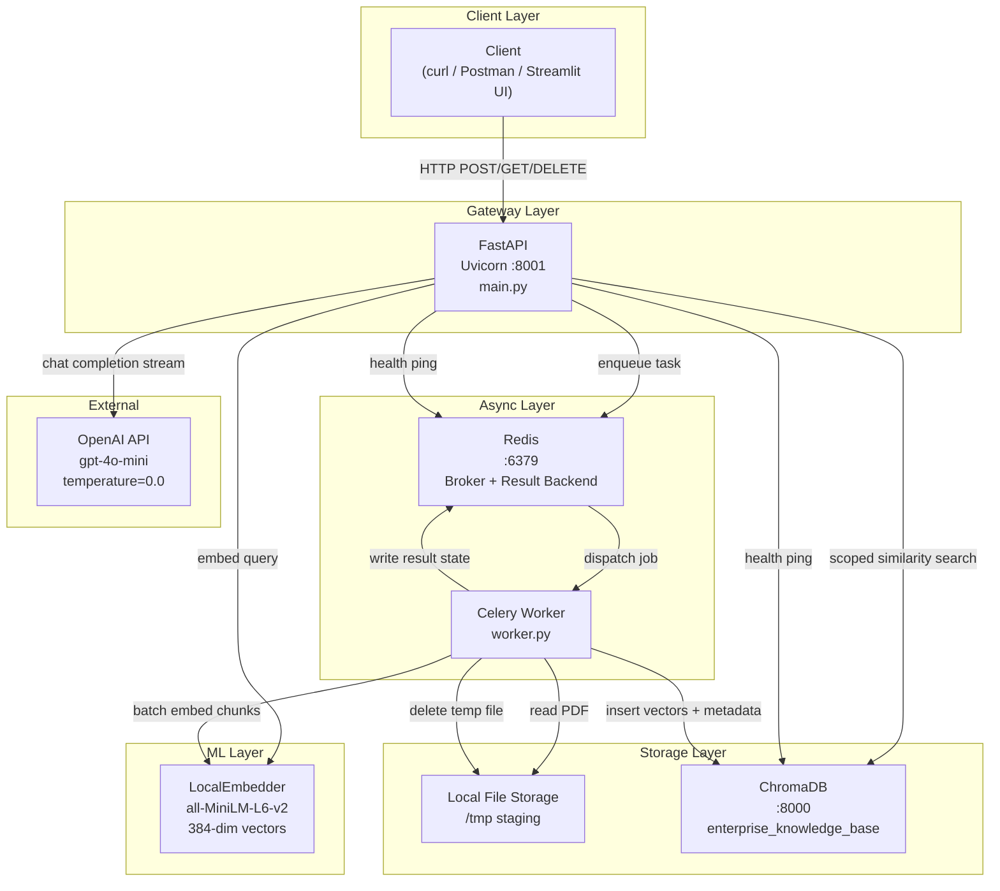
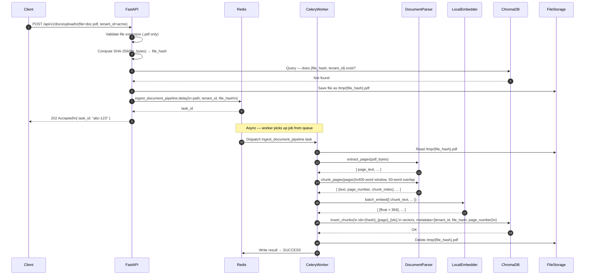
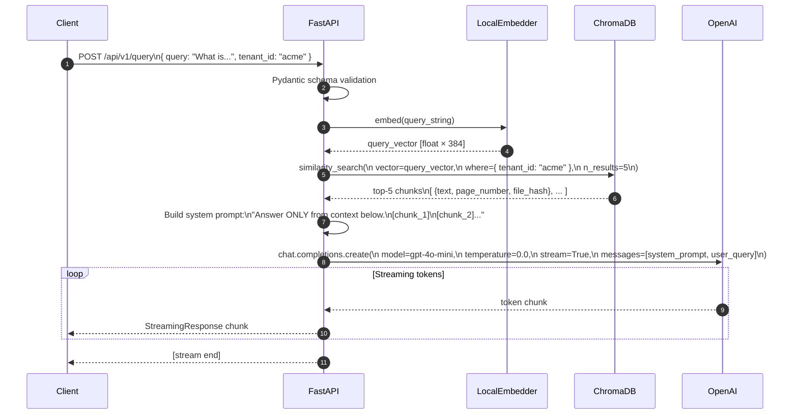
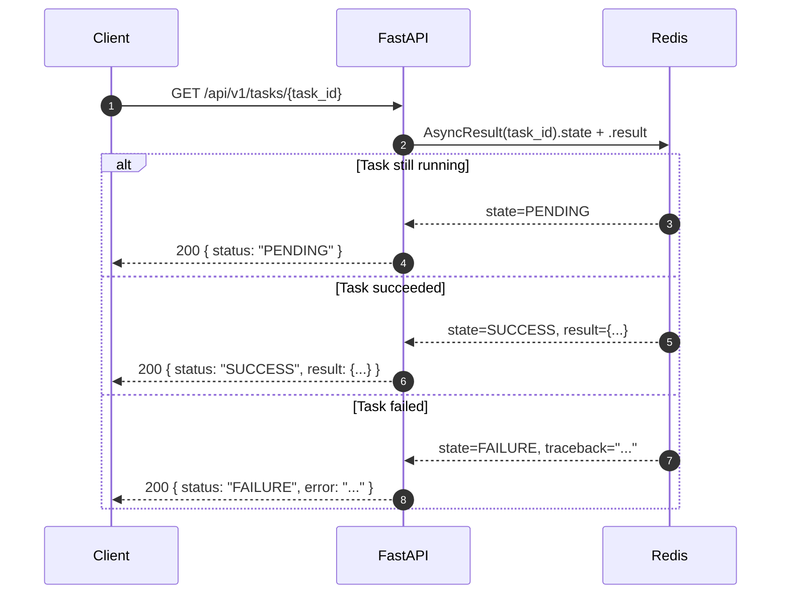
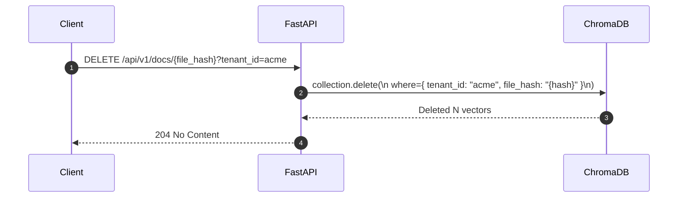
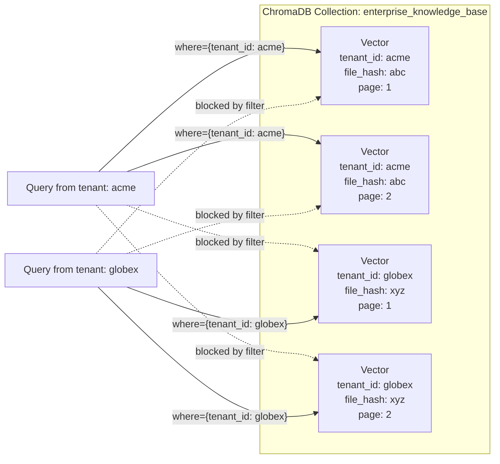
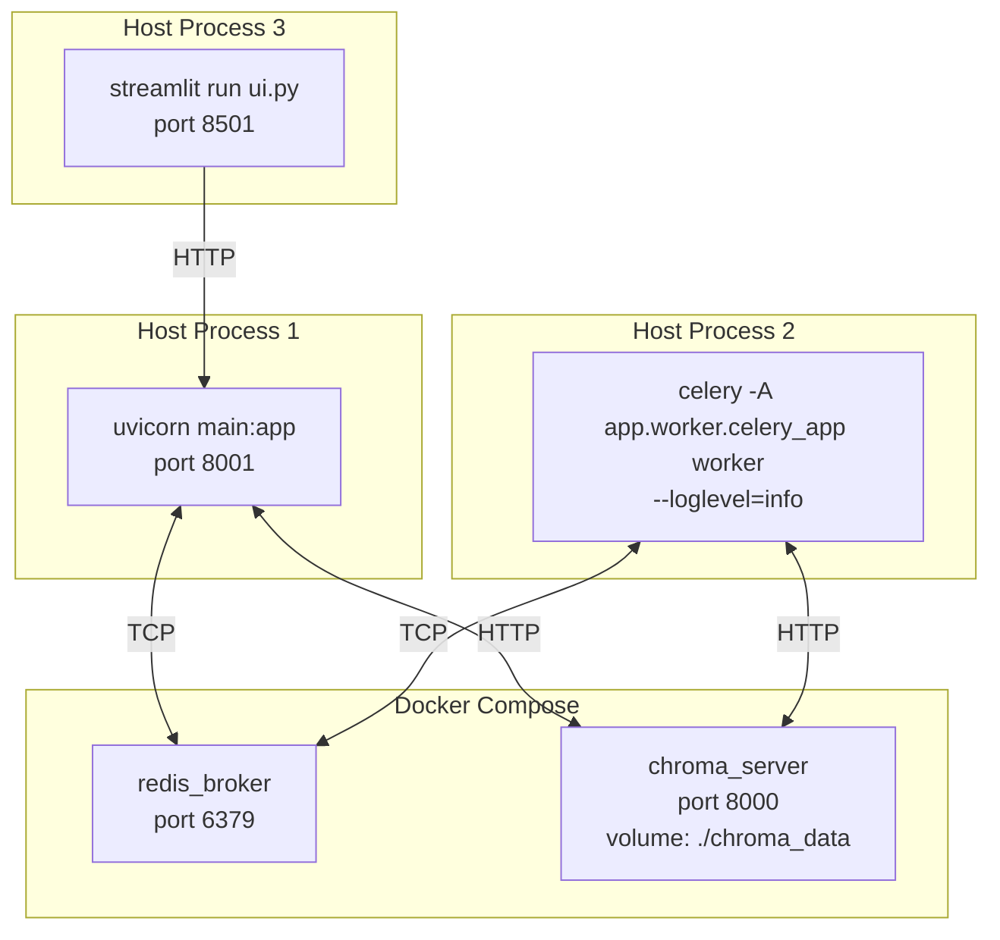

# Enterprise RAG — Architecture & Sequence Diagrams

---

## 1. System Architecture

High-level view of every component, its role, and how they connect.

### Component Responsibilities

| Component | Technology | Responsibility |
|-----------|-----------|----------------|
| **FastAPI Gateway** | FastAPI + Uvicorn | HTTP routing, input validation, auth boundary, request fan-out |
| **Redis** | Redis (Alpine) | Celery message broker, task result backend, health check target |
| **Celery Worker** | Celery | Background ingestion: parse → chunk → embed → store |
| **LocalEmbedder** | sentence-transformers | Converts text to 384-dim vectors; loaded once per process |
| **ChromaDB** | ChromaDB (Docker) | Persistent vector store with metadata-filtered tenant isolation |
| **Local File Storage** | Filesystem `/tmp` | Temporary staging for uploaded PDFs during ingestion |
| **OpenAI API** | gpt-4o-mini | Context-grounded answer synthesis at query time |

---

## 2. Data Flow: Document Ingestion

The full lifecycle from HTTP upload to vectors persisted in ChromaDB.

---

## 3. Data Flow: Semantic Query (RAG)

The full lifecycle from query string to streamed grounded answer.

---

## 4. Data Flow: Task Status Poll

How a client checks the outcome of an async ingestion job.

---

## 5. Data Flow: Document Deletion

How a document and all its vectors are purged from the system.

---

## 6. Multi-Tenant Isolation Model

Illustrates why tenant data cannot bleed across boundaries — the filter is enforced at the vector store layer, not the application layer.

---

## 7. Deployment Topology

How all processes run together locally.

