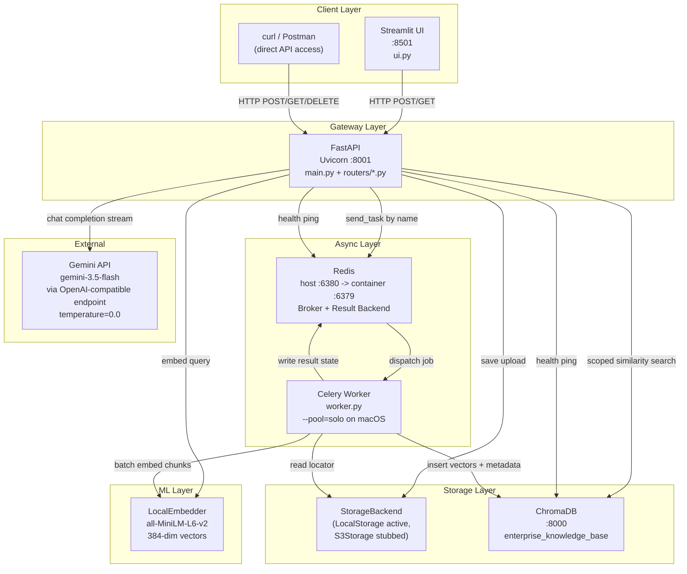
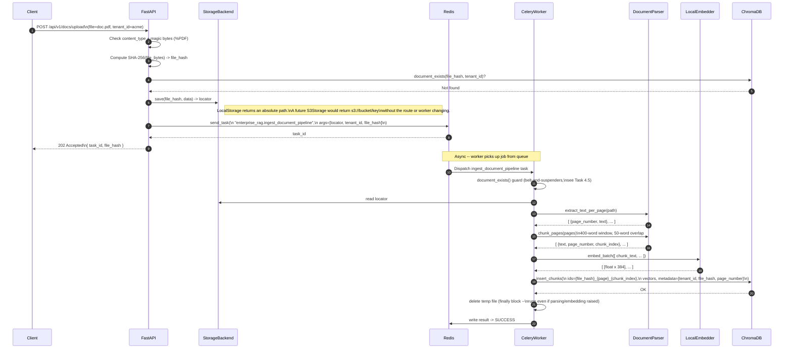
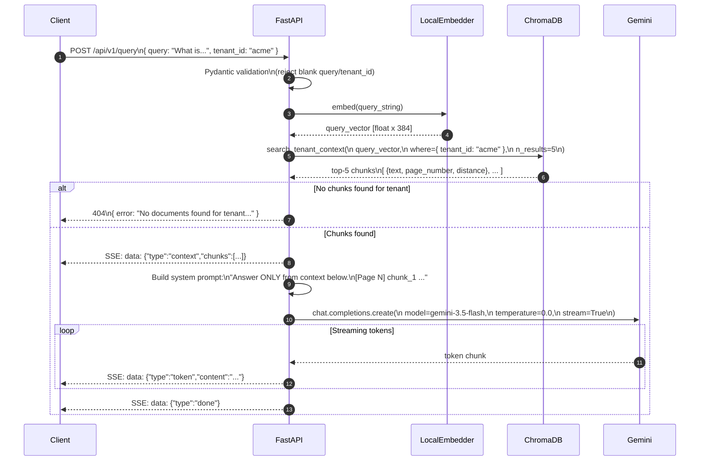
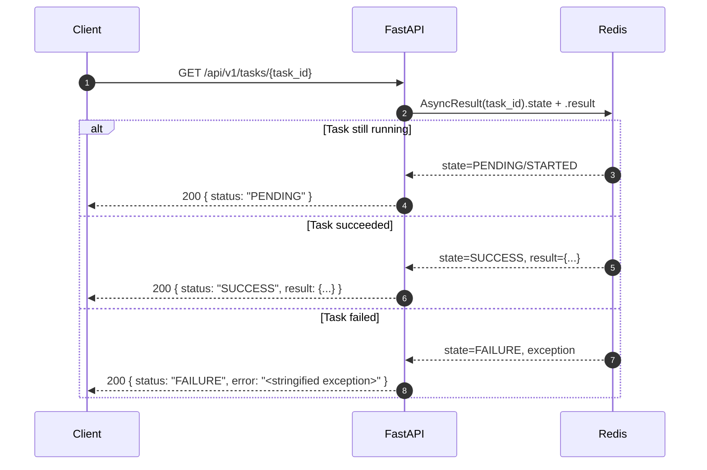
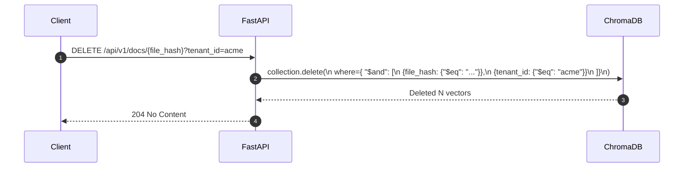
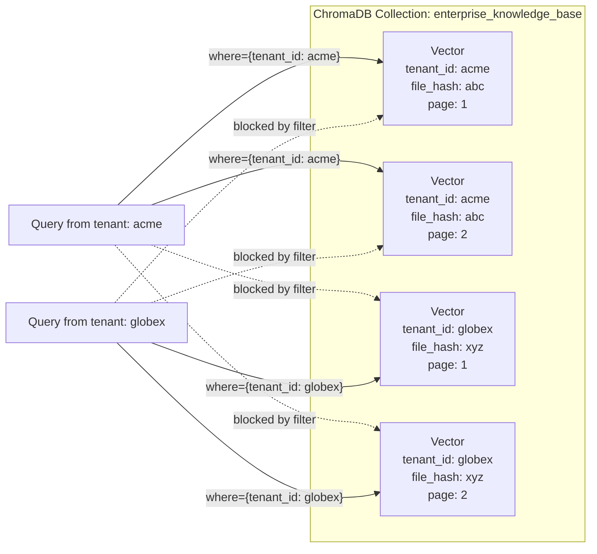
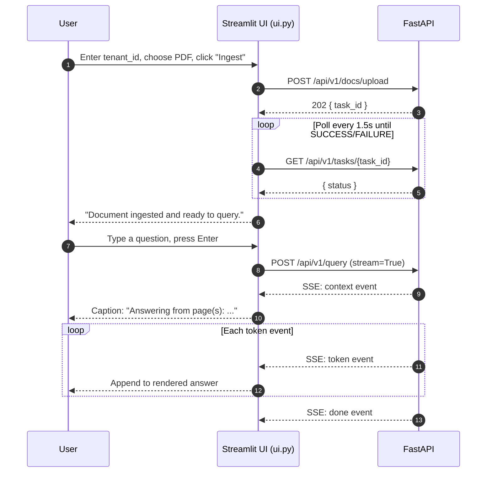
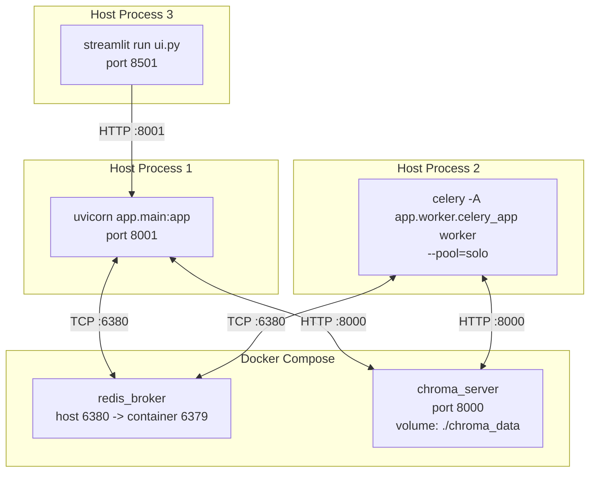

# Enterprise RAG — Architecture & Sequence Diagrams

Reflects the system as of Phase 7 (Streamlit UI added, Gemini as the LLM
provider, pluggable storage backend). Each diagram is followed by a short
explanation of what it shows and why it's built that way — read the prose,
not just the boxes.

---

## 1. System Architecture

High-level view of every component, its role, and how they connect.

### Component Responsibilities

| Component | Technology | Responsibility |
|-----------|-----------|----------------|
| **Streamlit UI** | Streamlit | Demo client — file uploader + chat, talks to FastAPI over plain HTTP like any external client (Task 7.1) |
| **FastAPI Gateway** | FastAPI + Uvicorn | HTTP routing, input validation, auth boundary, request fan-out |
| **Redis** | Redis (Alpine) | Celery message broker, task result backend, health check target |
| **Celery Worker** | Celery | Background ingestion: parse → chunk → embed → store |
| **LocalEmbedder** | sentence-transformers | Converts text to 384-dim vectors; loaded once per process |
| **StorageBackend** | Filesystem (default) / S3 (stub) | Abstracts *where* an uploaded PDF's bytes live — the route and worker only deal in an opaque "locator" string (Task 5.2/5.3) |
| **ChromaDB** | ChromaDB (Docker) | Persistent vector store with metadata-filtered tenant isolation |
| **Gemini API** | `gemini-3.5-flash` | Context-grounded answer synthesis at query time, called through Google's OpenAI-compatible endpoint so the app's client code is unaware of the provider (Task 6.3) |

**Why the client layer has two entry points:** the Streamlit UI is a convenience
demo client, not a privileged one — it hits the exact same `/api/v1/*` routes
any other HTTP client would. There's no server-side code that only the UI can
reach; that's what lets `ui.py` stay a plain `requests`-based script with zero
imports from `app/`.

---

## 2. Data Flow: Document Ingestion

The full lifecycle from HTTP upload to vectors persisted in ChromaDB.

**Why dispatch by task *name* (`send_task`) instead of importing the task
function:** importing `worker.py` from the FastAPI process would trigger its
module-level `LocalEmbedder()`/`VectorStoreManager()` singletons — paying for
an ~80 MB model load and a ChromaDB connection in a process that never runs
the task body. `send_task` only needs Celery-level agreement on a task name
and argument shape, not a shared Python import (Task 5.4).

**Known caveat — the composite ID has no tenant in it.** `{file_hash}_{page}_
{chunk_index}` is purely content-derived. If two different tenants upload a
byte-identical PDF, they produce identical ChromaDB IDs, and `collection.add()`
does not upsert on a duplicate ID — the second tenant's insert is silently
dropped even though the task still reports `SUCCESS`. See `learning.md`,
Task 7.1, for the full writeup; not yet fixed.

---

## 3. Data Flow: Semantic Query (RAG)

The full lifecycle from query string to a streamed, grounded answer.

**Why retrieval happens as plain code, before the SSE generator starts:** if
retrieval and generation were both inside the streaming generator, a 404
("no documents for this tenant") would have to be smuggled into the SSE
stream as a fake error event instead of a normal HTTP status. Doing the
embed + search step first means a 404 is a real, correctly-coded HTTP
response — the stream only ever starts once there's something to answer with
(Task 5.8/6.3).

**Why three SSE event types, not just raw tokens:** `context` arrives first
so a client (like the Streamlit UI) can show "answering from page N" before
any answer text exists; `token` events carry the incremental answer; `done`
is an explicit end-of-stream marker so the client can tell "finished
normally" apart from "connection dropped mid-answer."

**Why Gemini instead of OpenAI:** the original OpenAI key stopped working
mid-project. Because the code depends on the generic `openai.AsyncOpenAI`
client shape rather than an OpenAI-specific feature, switching providers was
a `base_url` + API key change in `app/dependencies.py` and `app/config.py` —
zero changes to `app/services/synthesis.py`'s streaming logic (Task 6.3).

---

## 4. Data Flow: Task Status Poll

How a client checks the outcome of an async ingestion job — this is what
the Streamlit UI's upload spinner polls in a loop (Task 7.1).

**Why this is a lookup, not a subscription:** `AsyncResult(task_id)` just
reads whatever key currently sits in Redis under that ID — it has no concept
of "does this ID exist." A made-up task ID reads back identically to a real
one that hasn't started yet (`PENDING` either way). The Streamlit UI's
polling loop (Task 7.1) exits on `SUCCESS`/anything-not-`PENDING/STARTED/
RETRY`, not on a fixed timeout, because there's no other way to know a job
finished short of asking again (Task 5.9).

---

## 5. Data Flow: Document Deletion

How a document and all its vectors are purged for one tenant.

**Why the compound `$and` filter, not just `{file_hash, tenant_id}`
shorthand:** ChromaDB's single-field shorthand (`{"k": "v"}`) only works for
one field at a time — a multi-field filter needs the explicit `$and` +
`$eq` form. The two-field filter is also the security boundary here: without
the `tenant_id` clause, any tenant that guessed or reused another tenant's
`file_hash` could delete that tenant's document (Task 3.6).

---

## 6. Multi-Tenant Isolation Model

Illustrates why tenant data cannot bleed across boundaries — the filter is
enforced at the vector store layer, not the application layer.

**Why this is enforced at the DB layer and not the application layer:**
`search_tenant_context()` takes `tenant_id` as a required positional
argument, not an optional filter a caller could forget to pass (Task 3.4).
There is no code path in the router that queries ChromaDB without it. This
was verified directly, not just assumed — Task 6.4 queried the same
question under two tenants and inspected the *retrieved chunks* (not just
the final answer) to confirm zero cross-tenant leakage in either direction.

**The one place this guarantee currently breaks:** the caveat in Section 2
— identical file bytes uploaded under two tenants collide on the *write*
path (composite ID has no tenant in it), before the read-path filter above
ever gets a chance to run. Isolation-by-filter only protects reads; it can't
undo a write that already landed under the wrong assumptions.

---

## 7. Data Flow: Streamlit UI Session

How the demo UI (Task 7.1) composes the three API calls above into one
browser session. `ui.py` has no server-side code of its own — every arrow
below is a plain HTTP call to the FastAPI gateway.

**Why `ui.py` polls instead of holding the upload request open:** the
ingestion task can take anywhere from under a second (small PDF, warm
embedder) to several seconds (large PDF); blocking the HTTP upload request
for that long would defeat the entire point of Celery's async dispatch
(Task 5.4). Polling `GET /tasks/{id}` on a fixed interval is the same
tradeoff described in Section 4 — simpler infra than a push mechanism, at
the cost of learning "it's done" up to one poll interval late.

---

## 8. Deployment Topology

How all processes run together locally. Only Redis and ChromaDB run in
Docker — the FastAPI, Celery, and Streamlit processes run directly on the
host so Python code changes don't require an image rebuild (see
`docker-compose.yml`'s header comment and `RUNNING.md`).

**Why `--pool=solo` and not the Celery default (`--pool=prefork`):**
`worker.py` loads `sentence-transformers`/PyTorch at module level before
Celery forks its child worker processes. Forking a process that has already
initialized certain native/Accelerate-backed libraries is unsafe on macOS
and segfaults the child (`signal 11`) as soon as a real task runs. `--pool=
solo` runs everything in a single process — no fork, no crash. Usually a
non-issue in a Linux container deployment; a very common local-dev trap on
macOS (`learning.md`, Task 6.1). Full run/stop instructions per process:
`RUNNING.md`.
